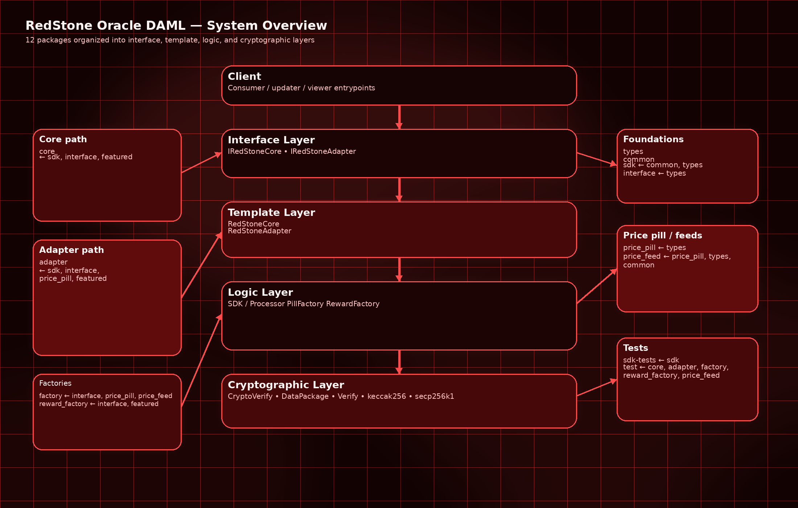
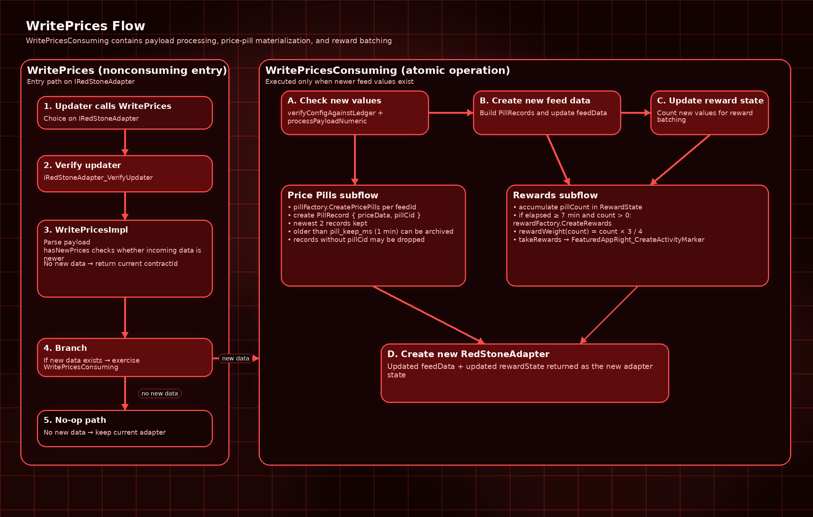
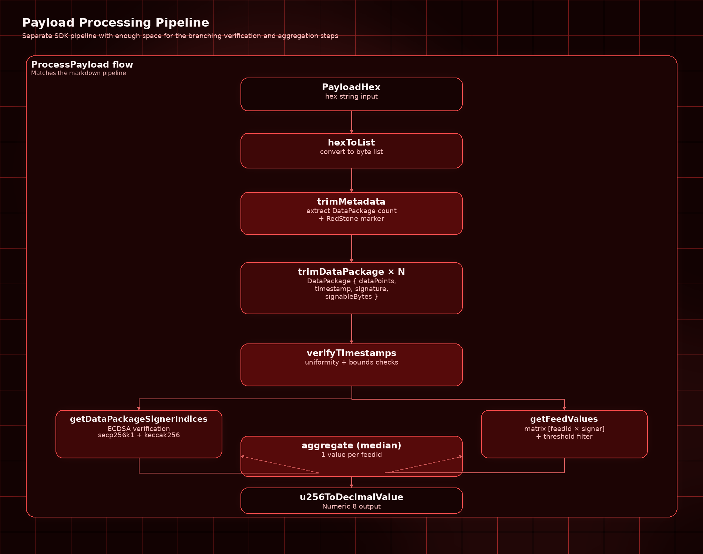
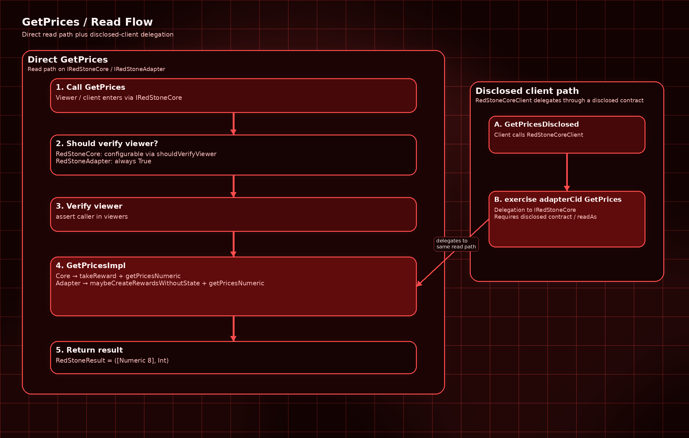
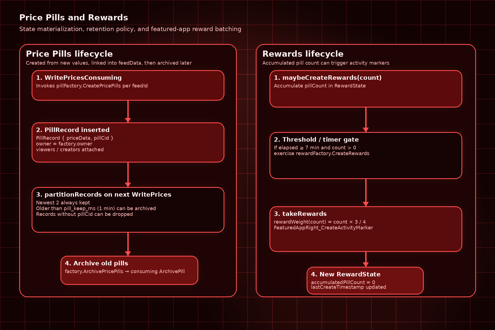

# RedStone Oracle DAML - Architecture

## 1. System overview

The RedStone Oracle system on Canton/Splice consists of 12 DAML packages forming a layered architecture of a price oracle with cryptographic data verification, state management (price pills), and reward distribution.

### 1.1 Layers



```text
[Client]
    |
    v
[IRedStoneCore / IRedStoneAdapter]     <- interface layer
    |
    v
[RedStoneCore / RedStoneAdapter]        <- template layer
    |           |           |
    v           v           v
[SDK/Processor] [PillFactory] [RewardFactory]   <- logic layer
    |
    v
[CryptoVerify / DataPackage / Verify]   <- cryptographic layer
```

### 1.2 Packages and dependencies

```text
types           (no dependencies)
common          (no dependencies)
sdk             <- common, types
sdk-tests       <- sdk
interface       <- types
price_pill      <- types (IRedStonePricePill)
featured        <- (splice-api-featured-app-v2)
core            <- sdk, interface, featured
adapter         <- sdk, interface, price_pill, featured
price_feed      <- price_pill, types, common
factory         <- interface, price_pill, price_feed
reward_factory  <- interface, featured
test            <- core, adapter, factory, reward_factory, price_feed
```

## 2. Data flow - WritePrices (main flow)



```text
1. Updater calls WritePrices on IRedStoneAdapter
   |
2. iRedStoneAdapter_VerifyUpdater - checks if caller is an updater
   |
3. iRedStoneAdapter_WritePricesImpl - nonconsuming choice
   |  - hasNewPrices: parses payload, checks if data is newer
   |  - if no new data → returns current contractId (no changes)
   |  - if new data exists → exercise WritePricesConsuming (consuming choice)
   |
4. WritePricesConsuming (atomic operation)
   |  - processAndWritePrices:
   |    a) checkNewValues → verifyConfigAgainstLedger + processPayloadNumeric
   |    b) newFeedData → create PillRecords + optionally Pills
   |    c) maybeCreateRewards → batch rewards every 7 minutes
   |    d) partitionRecords → archive old pills
   |
5. create new RedStoneAdapter with updated feedData and rewardState
```

### 2.1 Payload processing pipeline (SDK)



```text
PayloadHex (hex string)
    |
    v
hexToList → byte list
    |
    v
trimMetadata → DataPackage count + RedStone marker
    |
    v
trimDataPackage × N → [DataPackage{dataPoints, timestamp, signature, signableBytes}]
    |
    v
verifyTimestamps → check timestamp uniformity and bounds
    |
    v
getDataPackageSignerIndices → ECDSA verification (secp256k1 + keccak256)
    |                          → mapping signature to signer index
    v
getFeedValues → matrix [feedId × signer] → threshold filtering
    |
    v
aggregate (median) → 1 value per feedId
    |
    v
u256ToDecimalValue → Numeric 8
```

## 3. Data flow - GetPrices (read)



```text
1. Viewer/Client calls GetPrices on IRedStoneCore
   |
2. iRedStoneCore_ShouldVerifyViewer → decision whether to verify
   |  - RedStoneCore: configurable via shouldVerifyViewer
   |  - RedStoneAdapter: always True
   |
3. iRedStoneCore_VerifyViewer → assert caller in viewers
   |
4. iRedStoneCore_GetPricesImpl
   |  - RedStoneCore: takeReward + getPricesNumeric (process from payload)
   |  - RedStoneAdapter: maybeCreateRewardsWithoutState + getPricesNumeric
   |
5. Returns RedStoneResult = ([Numeric 8], Int)
```

### 3.1 GetPrices via RedStoneCoreClient (disclosed)

```text
1. Client calls GetPricesDisclosed on RedStoneCoreClient
   |
2. exercise adapterCid GetPrices → delegation to IRedStoneCore
   |  - requires disclosed contract (readAs)
```

## 4. Data flow - Price Pills



```text
WritePricesConsuming
    |
    v
pillFactory.CreatePricePills
    |  - creates RedStonePricePill per feedId
    |  - owner = factory.owner, viewers, creators
    |
    v
PillRecord{priceData, pillCid} added to feedData
    |
    v
partitionRecords (on next WritePrices)
    |  - newest 2: always kept
    |  - older than pill_keep_ms (1 min): archived
    |  - without pillCid: dropped (shouldDrop)
    |
    v
factory.ArchivePricePills → consuming ArchivePill
```

## 5. Data flow - Rewards

```text
WritePricesConsuming
    |
    v
maybeCreateRewards(count = length newValues)
    |  - accumulates pillCount in RewardState
    |  - if elapsed >= min_reward_creation_ms (7 min) and count > 0:
    |    → exercise rewardFactory.CreateRewards
    |      → rewardWeight(count) = count * 3 / 4
    |      → takeRewards(weight, beneficiary, featuredCid)
    |        → FeaturedAppRight_CreateActivityMarker
    |
    v
New RewardState{accumulatedPillCount=0, lastCreateTimestamp}
```

## 6. Access control

| Operation | Who can call | Verification |
|-----------|--------------|--------------|
| WritePrices | updaters | `iRedStoneAdapter_VerifyUpdater` |
| WritePricesConsuming | updaters | `caller elem updaters` (double) |
| ReadPrices / ReadPriceData | viewers + updaters | `iRedStoneAdapter_VerifyViewer` |
| GetPrices (Adapter) | viewers + updaters | `iRedStoneCore_VerifyViewer` |
| GetPrices (Core) | viewers | `iRedStoneCore_VerifyViewer` |
| GetUniqueSignerThreshold | viewers + updaters | `iRedStoneAdapter_VerifyViewer` |
| CreatePricePills | creators (= updaters) | `iRedStonePricePillFactory_VerifyCreator` |
| ArchivePricePills | creators | `iRedStonePricePillFactory_VerifyArchiver` |
| CreateRewards | creators | `iRedStoneRewardFactory_VerifyCreator` |
| ReadData / ReadPrice (Pill) | viewers + creators | `iRedStonePricePill_VerifyViewer` |
| ArchivePill | creators | `iRedStonePricePill_VerifyArchiver` |
| UpdatePillFactory | owner | `controller owner` |
| UpdateRewardFactory | owner | `controller owner` |
| UnlinkAllPills | owner | `controller owner` |

### 6.1 Signatories

| Template | Signatories | Consequences |
|----------|-------------|--------------|
| RedStoneAdapter | owner | Single-party control |
| RedStoneCore | owner, beneficiary | Requires both to create |
| RedStonePricePill | owner | Single-party control |
| RedStonePricePillFactory | owner | Single-party control |
| RedStoneRewardFactory | owner, beneficiary | Requires both to create |
| PriceUpdateEvent | owner | Created and archived in one transaction |

## 7. Cryptographic architecture

### 7.1 Signature verification

- **Algorithm**: ECDSA on secp256k1
- **Hashing**: Keccak256 (Ethereum-style)
- **Signature format**: 65 bytes → conversion to DER
- **Public keys**: 5 RedStone Primary Production keys (hardcoded)
- **Threshold**: 3 of 5 signers must sign data

### 7.2 Aggregation

- For each feedId, values are collected from N signers
- If < threshold → Error (rejection)
- If >= threshold → median calculation (resilient to 1 malicious signer at threshold=3)

## 8. Configuration constants

| Constant | Value | Location |
|----------|-------|----------|
| signerCountThreshold | 3 | Config.daml |
| maxDelayMs | 180,000 (3 min) | RedStone.Config |
| maxAheadMs | 60,000 (1 min) | RedStone.Config |
| pill_staleness_ms | 86,400,000 (1 day) | adapter/Config |
| pill_keep_ms | 60,000 (1 min) | adapter/Config |
| min_reward_creation_ms | 420,000 (7 min) | adapter/Config |
| reward_factor | 3/4 = 0.75 | RewardConfig |
| min_acceptable_timestamp | 1,773,705,600,000 (Mar 17, 2026) | Time.daml |
| Value precision | Numeric 8 (8 decimals) | RedStoneTypes |
| U256 size | 32 bytes | U256.daml |
