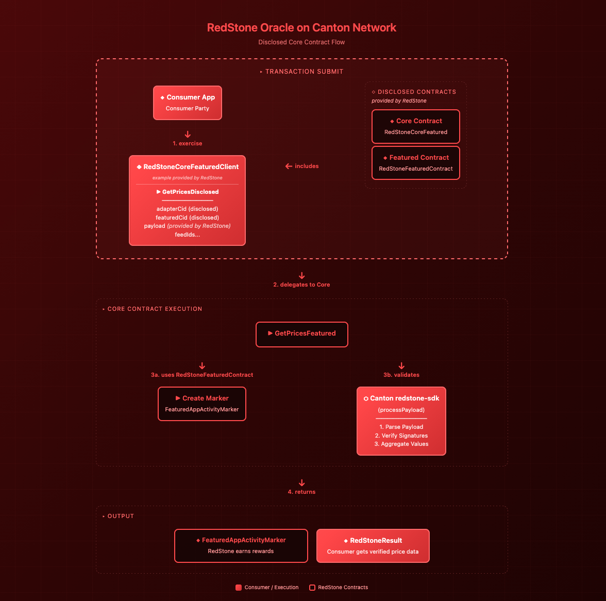

# RedStone Pull Oracle in Canton

<!-- TOC -->
* [RedStone Pull Oracle in Canton](#redstone-pull-oracle-in-canton)
  * [Canton Core](#canton-core)
    * [Definitions](#definitions)
      * [Interface](#interface)
      * [Contract template](#contract-template)
    * [Example usage](#example-usage)
  * [Disclosed Core Contract](#disclosed-core-contract)
    * [Example Client Contract Template](#example-client-contract-template)
      * [Dependency](#dependency)
      * [Parameter list](#parameter-list)
    * [TypeScript Contract Wrapper](#typescript-contract-wrapper)
      * [Parameters](#parameters)
    * [Existing Disclosed Contracts](#existing-disclosed-contracts)
    * [Data fetching (direct way)](#data-fetching-direct-way)
<!-- TOC -->

RedStone's Pull Model injects data directly into user transactions, simplifying dApp data access.
This streamlined approach handles the entire process in a single transaction, significantly reducing complexity.

The models and architecture of data are described in the [RedStone docs](https://docs.redstone.finance/docs/category/getting-started/).

## Canton Core

### Definitions

#### Interface

* The contract implements [`IRedStoneCore`](../interface/src/IRedStoneCore.daml) interface, basically by implementing
the `iRedStoneCore_GetPricesImpl` function.

```haskell
interface IRedStoneCore where
  iRedStoneCore_GetPricesImpl : [RedStoneFeedId] -> Time -> PayloadHex -> Update RedStoneResult

  nonconsuming choice GetPrices : RedStoneResult
    with
      feedIds : [RedStoneFeedId]
      currentTime : Time
      payloadHex : PayloadHex
    controller (view this).viewers
    do
      iRedStoneCore_GetPricesImpl this feedIds currentTime payloadHex

  nonconsuming choice GetPricesWithCaller : RedStoneResult
    with
      caller : Party
      feedIds : [RedStoneFeedId]
      currentTime : Time
      payloadHex : PayloadHex
    controller caller
    do
      iRedStoneCore_GetPricesImpl this feedIds currentTime payloadHex
```

The `GetPricesWithCaller` choice allows any party to call the contract directly (used for disclosed contract access).

#### Contract template

* By calling the nonconsuming `GetPrices` choice of the [`RedStoneCore`](./src/RedStoneCore.daml) template,
the payload data is processed as described in the [`RedStone SDK]`](../sdk/README.md) library
and the [`RedStoneResult`](../interface/src/RedStoneTypes.daml) is returned to the caller.
* The `RedStoneCore` template optionally supports `FeaturedAppRight` integration via `beneficiary` and `featuredCid` fields.
* The `iRedStoneCore_GetPricesImpl` implementation:

```haskell
  iRedStoneCore_GetPricesImpl feedIds currentTime payloadHex = do
      case (featuredCid, beneficiary) of
        (Some featured, Some party) -> takeReward party featured
        _ -> pure ()

      let config = adapter_config_fun feedIds currentTime
      G.getPricesNumeric config payloadHex
```
where all necessary functions are defined in the [`RedStone SDK`](../sdk) library.

See more about configuring, data processing and the output in the [`RedStone SDK`](../sdk/README.md) library README file.

### Example usage

* Use the prepared [Core.daml](../test/src/Core.daml) flow by running `make run-Core`
and `make prepare_data` before, if needed.
* or use the flow similar to the one inside [Makefile](../ops.mk)

## Disclosed Core Contract



RedStone provides a disclosed Core Contract, invoking the `FeaturedAppRight` inside.
The disclosed contract allows any party to fetch and execute oracle price feeds
without being a stakeholder on the Core contract.
The caller submits the transaction with the Core contract and FeaturedAppRight as disclosed contracts,
gaining visibility to both.
Since the Core contract has the beneficiary (`FeaturedAppRight` provider) as a signatory,
it has authorization to create `FeaturedAppActivityMarkers`, enabling RedStone to earn app rewards for each oracle usage.

### Example Client Contract Template

```haskell
module RedStoneCoreClient where

import IRedStoneCore

type RedStoneValue = Numeric 8
type RedStoneResult = ([RedStoneValue], Int)
type RedStoneFeedId = [Int]

template RedStoneCoreClient
  with
    owner : Party
    viewers : [Party]
  where
    signatory owner
    observer viewers

    nonconsuming choice GetPricesDisclosed : RedStoneResult
      with
        caller : Party
        feedIds : [RedStoneFeedId]
        currentTime : Time
        payloadHex : Text
        adapterCid : ContractId IRedStoneCore
      controller viewers
      do
          exercise adapterCid GetPricesWithCaller with
            caller
            feedIds
            currentTime
            payloadHex
```

#### Dependency

The contract requires `redstone-featured-vX-A.B.C.dar` to be added as a data-dependency in the daml.yaml file.

#### Parameter list

Template fields:

- `owner`: Party that created and controls this client contract
- `viewers`: List of parties authorized to query oracle prices

GetPricesDisclosed choice:

- `caller`: Party executing the transaction (must be in viewers)
- `feedIds`: List of price feed identifiers to query. Each feed ID is represented as a list of ASCII character codes
   (e.g., `ETH = [69, 84, 72]`, `BTC = [66, 84, 67]`)
- `currentTime`: Current real-world timestamp for price validation (ensures payload freshness)
- `payloadHex`: Hex-encoded RedStone payload containing signed price data,
   see: [Data Formatting & Processing](https://docs.redstone.finance/docs/architecture/#data-formatting--processing)
- `adapterCid`: Contract ID of the disclosed Core contract (`IRedStoneCore`)

### [TypeScript Contract Wrapper](../../src/adapters/CoreClientCantonContractAdapter.ts)

See the full example in [core-client-sample.ts](../../scripts/core-client-sample.ts).

```ts
const partyId = `Client::1220a0242797a84e1d8c492f1259b3f87d561fcbde2e4b2cebc4572ddfc515b44c28`;
const packageId = "#redstone-core-v2";
const contractId =
        "008a2bdfb2ed5fe9c0423a2e69249bd5304dbabdf8430f97b73da292b1e3cd837eca1212200a9b1951afdec72efba48a2a35b8f25a8b00016ce4057b1de1bbc544019df895";

export async function coreClientSample() {
  const client = makeDefaultClient(partyName);
  const adapter = new CoreClientCantonContractAdapter(client, contractId, packageId);
  const paramsProvider = new ContractParamsProvider({
    dataPackagesIds: ["ETH", "BTC"],
    dataServiceId: "redstone-primary-prod",
    uniqueSignersCount: 3,
    authorizedSigners: getSignersForDataServiceId("redstone-primary-prod"),
  });

  console.log(await adapter.getPricesFromPayload(paramsProvider));
}

void coreClientSample();
```

#### Parameters

The `partyId`, `packageId` and `contractId` are identifiers obtained when creating the `RedStoneCoreClient` contract.

- `partyId`: Your party identifier on the Canton network
- `packageId`: Package hash of the deployed `redstone-core-client` DAR
- `contractId`: Contract ID of your `RedStoneCoreClient` instance
- `ContractParamsProvider`: Configures which price feeds to fetch and validation parameters

### Existing Disclosed Contracts

The existing disclosed contract data are available in the [contracts.json](../../src/contracts.json) file.

### Data fetching (direct way)

Payload generation is available in the `@redstone-finance/sdk` package via [payload-generator](../../../sdk/scripts/payload-generator) scripts.

You can either:
- Use the [Makefile](../../../sdk/scripts/payload-generator/Makefile) directly
- Call it programmatically in TypeScript by creating a [`ContractParamsProvider`](../../../sdk/src/contracts/ContractParamsProvider.ts) instance
