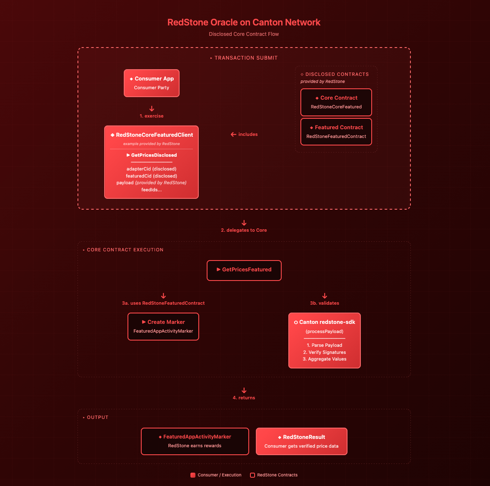

# RedStone Oracle on Canton Network

<!-- TOC -->
* [RedStone Oracle on Canton Network](#redstone-oracle-on-canton-network)
  * [Disclosed Core Contract](#disclosed-core-contract)
    * [Example Client Contract Template](#example-client-contract-template)
      * [Dependency](#dependency)
      * [Parameter list](#parameter-list)
    * [TypeScript Contract Wrapper](#typescript-contract-wrapper)
      * [Parameters](#parameters)
    * [Existing Disclosed Contracts](#existing-disclosed-contracts)
    * [Data fetching (direct way)](#data-fetching-direct-way)
<!-- TOC -->

RedStone's Pull Model injects data directly into user transactions, simplifying dApp data access.
This streamlined approach handles the entire process in a single transaction, significantly reducing complexity.

The models and architecture of data are described in the [RedStone docs](https://docs.redstone.finance/docs/category/getting-started/).

## Disclosed Core Contract



RedStone provides a disclosed Core Contract, invoking the `FeaturedAppRight` inside.
The disclosed contract allows any party to fetch and execute oracle price feeds
without being a stakeholder on the Core contract.
The caller submits the transaction with the Core contract and FeaturedAppRight as disclosed contracts,
gaining visibility to both.
Since the Core contract has the beneficiary (`FeaturedAppRight` provider) as a signatory,
it has authorization to create `FeaturedAppActivityMarkers`, enabling RedStone to earn app rewards for each oracle usage.

### Example Client Contract Template

```haskell
module RedStoneCoreFeaturedClient where

import Featured
import IRedStoneCoreFeatured

type RedStoneValue = Numeric 8
type RedStoneResult = ([RedStoneValue], Int)
type RedStoneFeedId = [Int]

template RedStoneCoreFeaturedClient
  with
    owner : Party
    viewers : [Party]
  where
    signatory owner
    observer viewers

    nonconsuming choice GetPricesDisclosed : RedStoneResult
      with
        caller : Party
        feedIds : [RedStoneFeedId]
        currentTime : Time
        payloadHex : Text
        adapterCid : ContractId IRedStoneCoreFeatured
        featuredCid : RedStoneFeaturedContract
      controller viewers
      do
          exercise adapterCid GetPricesFeatured with
            caller
            feedIds
            currentTime
            payloadHex
            featuredCid
```

#### Dependency

The contract requires `redstone-featured-vX-A.B.C.dar` to be added as a data-dependency in the daml.yaml file.

#### Parameter list

Template fields:

- `owner`: Party that created and controls this client contract
- `viewers`: List of parties authorized to query oracle prices

GetPricesDisclosed choice:

- `caller`: Party executing the transaction (must be in viewers)
- `feedIds`: List of price feed identifiers to query. Each feed ID is represented as a list of ASCII character codes
   (e.g., `ETH = [69, 84, 72]`, `BTC = [66, 84, 67]`)
- `currentTime`: Current real-world timestamp for price validation (ensures payload freshness)
- `payloadHex`: Hex-encoded RedStone payload containing signed price data,
   see: [Data Formatting & Processing](https://docs.redstone.finance/docs/architecture/#data-formatting--processing)
- `adapterCid`: Contract ID of the disclosed Core contract (`IRedStoneCoreFeatured`)
- `featuredCid`: Contract ID of the disclosed `FeaturedAppRight` for reward attribution

### [TypeScript Contract Wrapper](../../src/adapters/CoreFeaturedClientCantonContractAdapter.ts)

See the full example in [core-featured-sample.ts](../../scripts/core-featured-sample.ts).

```ts
const partyId = `Client::1220a0242797a84e1d8c492f1259b3f87d561fcbde2e4b2cebc4572ddfc515b44c28`;
const packageId = "3892dcfb99c55f2620dc38de2f62160b6dda44b67acd8b12af22b4cb652c8ee0";
const contractId =
        "006f39a996caf6f8fe7b885788b40d350349a48391de2a3fb3e656ff97262b2dd4ca121220d6e33c5d817e76a86c20a9e8a954f7c8d6e193838a340bb833d028dca6ead506";

export async function coreFeaturedClientSample() {
  const tokenProvider = () => keycloakTokenProvider();

  const client = new CantonClient(partyId, getJsonApiUrl(), tokenProvider, readNetwork());
  const adapter = new CoreClientCantonContractAdapter(client, contractId, packageId);
  const paramsProvider = new ContractParamsProvider({
    dataPackagesIds: ["ETH", "BTC"],
    dataServiceId: "redstone-primary-prod",
    uniqueSignersCount: 3,
    authorizedSigners: getSignersForDataServiceId("redstone-primary-prod"),
  });

  console.log(await adapter.getPricesFromPayload(paramsProvider));
}

void coreFeaturedClientSample();
```

#### Parameters

The `partyId`, `packageId` and `contractId` are identifiers obtained when creating the `RedStoneCoreFeaturedClient` contract.

- `partyId`: Your party identifier on the Canton network
- `packageId`: Package hash of the deployed `redstone-core-featured-client` DAR
- `contractId`: Contract ID of your `RedStoneCoreFeaturedClient` instance
- `ContractParamsProvider`: Configures which price feeds to fetch and validation parameters

### Existing Disclosed Contracts

The existing disclosed contract data are available in the [contracts.json](../../src/contracts.json) file.

### Data fetching (direct way)

Payload generation is available in the `@redstone-finance/sdk` package via [payload-generator](../../../sdk/scripts/payload-generator) scripts.

You can either:
- Use the [Makefile](../../../sdk/scripts/payload-generator/Makefile) directly
- Call it programmatically in TypeScript by creating a [`ContractParamsProvider`](../../../sdk/src/contracts/ContractParamsProvider.ts) instance
