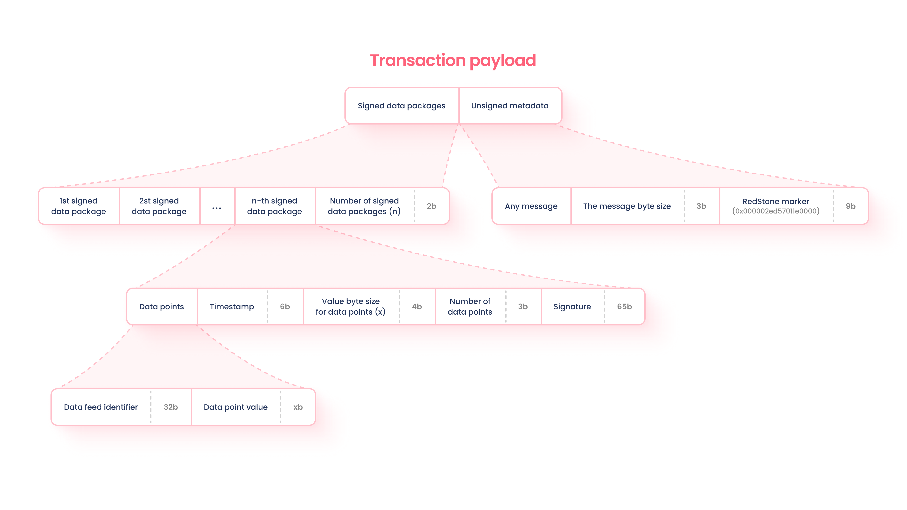
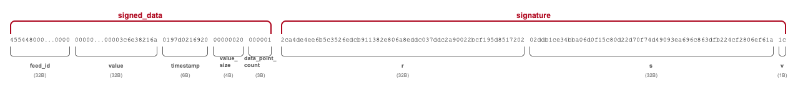
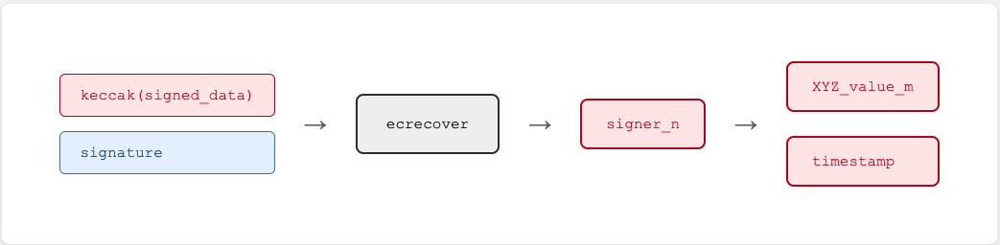
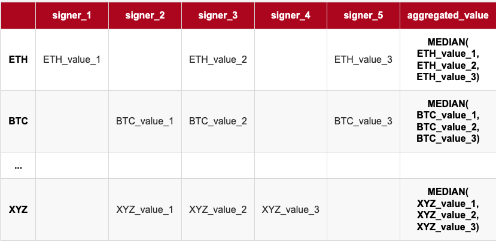
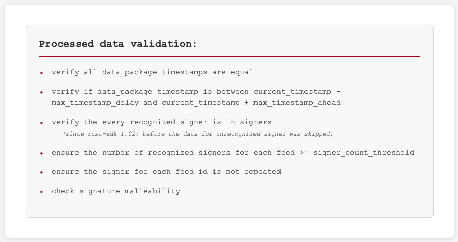

# RedStone Canton Connector - sdk

<!-- TOC -->
* [RedStone Canton Connector - sdk](#redstone-canton-connector---sdk)
  * [RedStone data processing](#redstone-data-processing)
    * [Processor](#processor)
      * [Parameters](#parameters)
      * [Processing](#processing)
      * [Validation](#validation)
  * [Configuration](#configuration)
    * [Supporting functions](#supporting-functions)
  * [Example usage](#example-usage)
    * [Working example](#working-example)
  * [Preparing data](#preparing-data)
<!-- TOC -->

## RedStone data processing

### Processor

[The Processor](./src/RedStone/Processor.daml) module contains the main processor of the RedStone payload.

- To process payload use `processPayload` or `processPayloadNumeric` function defined in the module.

```haskell
processPayloadNumeric: Config -> Text -> ProcessorResult

processPayload: Config -> Text -> ProcessorRawResult
```

#### Parameters

- The `config` argument is the configuration described [below](#configuration)
- The `payload` argument is hex-`Text` type representing the data bytes
  - the whole encoding is described in the RedStone Finance Docs:
    [data formatting](https://docs.redstone.finance/docs/architecture/#how-data-is-encoded-before-being-put-on-the-blockchain).
- The result of `processPayload` - [`ProcessorResult/ProcessorRawResult`](./src/RedStone/ProcessorResult.daml) contains a validated payload consisting of:
  - `values` -  each element in the array represents a processed `Result`-value corresponding to the `data_feed` item in the `config` (or an error message)
  - `timestampMs` - which is the data timestamp encountered during processing
- The values are in raw [`U256`](./src/RedStone/U256.daml) format or `DecimalValue` (`Numeric 8`) denominated by default RedStone decimals denominator (`10^8`)
- The `*Numeric` version is supported only for the decimal values up to `2^99` (`2^126` as multiplied by `10^8`) due to `Decimal` DAML type limitations.

#### Processing



* The function parses payload-bytes into [`DataPackages`](./src/RedStone/Internal/DataPackage.daml),
    consisting of [`DataPoints`](./src/RedStone/Internal/DataPoint.daml)



* Each [`DataPackage`](./src/RedStone/Internal/DataPackage.daml) is signed by a signer, to be recovered having the `DataPackage`'s data
    and the [`secp256k1`-curve](./src/RedStone/Internal/CryptoVerify.daml) based signature (both are included in the payload-bytes)
* The recovering is important in the aggregation process:
  * only the data signed by trusted signers (part of `config`) are counted to the aggregation (median value)
  * otherwise, if the signer count threshold is still achieved, it returns the data - or returns an error message for the particular feed

```haskell
(
[
  Ok 3114.205,
  Error \"[RedStone.VerificationError] Signer count not achieved with: [9007390000000,9007390000000]\"
],
1765215110000
)
```



* The aggregation (median values) is based on building a matrix: for each `feed_id` (in rows) from the `config`
  the values for particular trusted signers in columns (taken by their indices).



#### Validation



## Configuration

Configuration module contains configuration for the [`Processor`](#processor).

The [`Config`](./src/RedStone/Config.daml) structure consists of:
* `feedIds` to be processed by the `Processor`
* `currentTimestamp`
  * The ledger doesn't have access to real world timestamp, so it's necessary to pass off-chain `currentTimestamp`
    where later the methods like [`isLedgerTimeLE/LT/GE/GT`](https://docs.digitalasset.com/build/3.4/reference/daml/stdlib/DA-Time.html#function-da-time-isledgertimelt-78120) or [`assertWithDeadline`](https://docs.digitalasset.com/build/3.4/reference/daml/stdlib/DA-Assert.html#function-da-assert-assertwithindeadline-85580`) are used to have it verified
* `signers` the authorized signers of the data
* `signerCountThreshold` - the threshold of different signers for the data to use it
* `maxDelayMs`/`maxAheadMs` - the acceptable data timestamp window, in relation to the `currentTimestamp`

### Supporting functions

To create a config, use one of the following functions

```haskell
config maxAheadMs maxDelayMs signerCountThreshold signers feedIds currentTime
```

Common contract default config for different signers

```haskell
default_signer_count_threshold = 3

defaultConfig = config (1 * one_min_ms) (3 * one_min_ms) default_signer_count_threshold
```

Complete config for `redstone-primary-prod` dataServiceId, to use with passing only `feedIds` and `currentTimestamp`

```haskell
redstone_primary_prod_public_keys = ...

redstonePrimaryProdDefaultConfig = defaultConfig redstone_primary_prod_public_keys
```

## Example usage

```haskell
module Main where

import Daml.Script
import RedStone.Processor
import RedStone.Config

data Input = Input with
  feedIds: [[Int]]
  payload: Text
      deriving (Eq, Show)
      
main : Input -> Script ()
main input = script do
    currentTime <- getTime
    
    let config = redstonePrimaryProdDefaultConfig input.feedIds currentTime
    
    let resultNumeric = processPayloadNumeric config input.payload 
    let result = processPayload config input.payload 
    
    debug (resultNumeric)
    debug (result)
```

### Working example

Use `make run_main` using the `Makefile` defined [here](../Makefile)

## Preparing data

Use `make prepare_data` using the `Makefile` defined [here](../data.mk)
