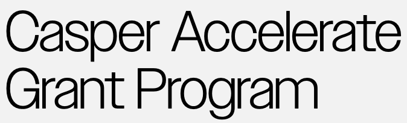

# 🔗 @redstone-finance/casper-connector

[](https://discord.gg/2CT6hN6C)
[](https://twitter.com/intent/follow?screen_name=redstone_defi)

Proudly supported by:
[](#-the-casper-grant-program)

RedStone proposes a completely new modular design where data is first put into a data availability layer and then
fetched on-chain. This allows us to broadcast a large number of assets at high frequency to a cheaper layer and put it
on-chain only when required by the protocol.

The `@redstone-finance/casper-connector` module implements an alternative design of providing oracle data to smart
contracts. Instead of constantly persisting data on the Casper network storage (by data providers), the information is
brought on-chain only when needed (by end users). Until that moment data remains in the decentralised cache layer, which
is powered by RedStone light cache gateways and streamr data broadcasting protocol. Data is transferred to the Casper
network by end users. The information integrity is verified on-chain through signature checking.

Here also you can find the description of
the [whole RedStone Oracle model](https://docs.redstone.finance/docs/introduction).

- [👨‍💻 Code structure](#-code-structure)
- [🔥 Connecting to the contract](#-connecting-to-the-contract)
- [⚡ The Casper Grant Program](#-the-casper-grant-program)
- [📄 License](#-license)

## 👨‍💻 Code structure

- [rust](rust) directory contains the casper-network on-chain libraries written in Rust `1.68.2`.
  - You can read [here](rust/contracts/README.md) how the contracts work.
  - [redstone](rust/redstone_casper) directory contains the RedStone library containing aggregation as well as full
    data-processing written in Rust
    - There are also various tests of signature verification with the given signers, timestamp validation, value
      aggregation as well as full data-processing tests with various configurations.
  - [tests](rust/contracts/tests) directory contains various integration and unit tests of contracts having their
    WASM-compiled
    code.
- [src](src) directory contains the typescript classes, useful for establishing a connection between typescript and
  casper-network layers.
  - See [below](#-connecting-to-the-contract), how to connect to the contract.
- [test](test) directory contains the TypeScript SDK tests
  - [unit tests](test/unit) on real network
  - [e2e contract tests](test/e2e) on real network

## 🔥 Connecting to the contract

First, you need to import the connector code to your project

```ts
// Typescript
import {
  PriceAdapterCasperContractConnector,
  makeCasperConnection,
} from "@redstone-finance/casper-connector";
// or: import { PriceRelayAdapterCasperContractConnector } from "@redstone-finance/casper-connector";
import { ContractParamsProvider } from "@redstone-finance/sdk";

// Javascript
const {
  PriceAdapterCasperContractConnector,
  makeCasperConnection,
  // or: PriceRelayAdapterCasperContractConnector
} = require("@redstone-finance/casper-connector");
const { ContractParamsProvider } = require("@redstone-finance/sdk");
```

Then you can invoke the contract methods described above pointing to the
selected [RedStone data service](https://app.redstone.finance) and requested data feeds.

```ts
const prices = new PriceAdapterCasperContractConnector(
  makeCasperConnection(yourConfig),
  yourContractPackageHash
);
/* or const prices = new PriceRelayAdapterCasperContractConnector(
yourWalletOrProvider,
  yourContractAddress
);
*/

const paramsProvider = new ContractParamsProvider({
  dataServiceId: "redstone-main-demo",
  uniqueSignersCount: 1,
  dataPackagesIds: ["ETH", "BTC"],
});
```

The `yourConfig` param is required. The example value can be found in
the [test/e2e/config.ts](./test/e2e/config.ts) file.

Now you can access any of the contract's methods by invoking the code:

```ts
(await prices.getAdapter()).getPricesFromPayload(paramsProvider); // the method is available only for PriceRelayAdapterCasperContractConnector
(await prices.getAdapter()).writePricesFromPayloadToContract(paramsProvider);
(await prices.getAdapter()).readPricesFromContract(paramsProvider);
(await prices.getAdapter()).readTimestampFromContract();
```

### Installing the dependencies

```bash
yarn install
```

## ⚡ The Casper Grant Program

The Casper Accelerate Grant Program has been created to exclusively support projects and developers building
on the Casper Public Mainnet to grow and secure the Casper Network.
[Read more here](https://casper.network/en-us/lp/accelerate-grant-program/)

## 📄 License

RedStone Casper connector is an open-source and free software released under the BUSL-1.1 License.
