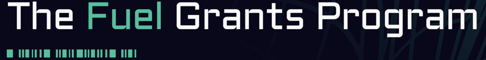

# 🔗 @redstone-finance/fuel-connector

[](https://discord.gg/2CT6hN6C)
[](https://twitter.com/intent/follow?screen_name=redstone_defi)

Proudly supported by:
[](#-the-fuel-grants-program)

RedStone proposes a completely new modular design where data is first put into a data availability layer and then
fetched on-chain. This allows us to broadcast a large number of assets at high frequency to a cheaper layer and put it
on chain only when required by the protocol.

The `@redstone-finance/fuel-connector` module implements an alternative design of providing oracle data to smart
contracts. Instead of constantly persisting data on the Fuel network storage (by data providers), the information is
brought on-chain only when needed (by end users). Until that moment data remains in the decentralised cache layer, which
is powered by RedStone light cache gateways and streamr data broadcasting protocol. Data is transferred to the Fuel
network by end users. The information integrity is verified on-chain through signature checking.

Here also you can find the description of
the [whole RedStone Oracle model](https://docs.redstone.finance/docs/introduction).

- [👨‍💻 Code structure](#-code-structure)
- [🔥 Connecting to the contract](#-connecting-to-the-contract)
- [⚡ The Fuel Grants Program](#-the-fuel-grants-program)
- [📄 License](#-license)

## 👨‍💻 Code structure

- [sway](sway) directory contains the fuel-network on-chain libraries written in sway `0.64.0`.
  - There are also various tests of signature verification with the given signers, timestamp validation, value
    aggregation as well as full data-processing tests with various configurations.
  - You can find all the possibilities [here](sway/README.md).
  - You can read [here](sway/contract/README.md) how the contract works.
- [src](src) directory contains the typescript classes, useful for establishing a connection between typescript and
  fuel-network layers.
  - See [below](#-connecting-to-the-contract), how to connect to the contract.
- [test](test) directory contains the off-chain tests, especially:
  - [e2e contract usage tests](test/prices/prices.spec.ts) - with payload sending and receiving aggregated data
  - [integration tests](test/prices/integration.spec.ts) - to be used for checking if the contract was properly
    initialized in the fuel network
  - [gas usage tests](test/prices/gas-usage.spec.ts) - to be used for checking the gas costs of particular
    operations in various configurations and also
    the summary of the single item costs.

## 🔥 Connecting to the contract

First, you need to import the connector code to your project

```ts
// Typescript
import { FuelPricesContractConnector } from "@redstone-finance/fuel-connector";
import { ContractParamsProvider } from "@redstone-finance/sdk";

// Javascript
const {
  FuelPricesContractConnector,
} = require("@redstone-finance/fuel-connector");
const { ContractParamsProvider } = require("@redstone-finance/sdk");
```

Then you can invoke the contract methods described above pointing to the
selected [RedStone data service](https://app.redstone.finance) and requested data feeds.

```ts
const prices = new FuelPricesContractConnector(
  yourWalletOrProvider,
  yourContractAddress
);

const paramsProvider = new ContractParamsProvider({
  dataServiceId: "redstone-main-demo",
  uniqueSignersCount: 1,
  dataPackagesIds: ["ETH", "BTC"],
});
```

The `yourWalletOrProvider` param is needed to be passed for testnet usage. For the local network, it can remain
undefined.

Now you can access any of the contract's methods by invoking the code:

```ts
(await prices.getAdapter()).getPricesFromPayload(paramsProvider);
(await prices.getAdapter()).writePricesFromPayloadToContract(paramsProvider);
(await prices.getAdapter()).readPricesFromContract(paramsProvider);
(await prices.getAdapter()).readTimestampFromContract();
```

### Installing the dependencies

```bash
yarn install
```

## ⚡ The Fuel Grants Program

The Fuel Grants Program is designed to support projects building on Fuel. It's offering generous grants to developers,
creators, and new or existing projects to build on the world's fastest modular execution layer.
[Read more here](https://fuel-labs.ghost.io/introducing-the-fuel-grants-program/)

## 📄 License

RedStone Fuel connector is an open-source and free software released under the BUSL-1.1 License.
