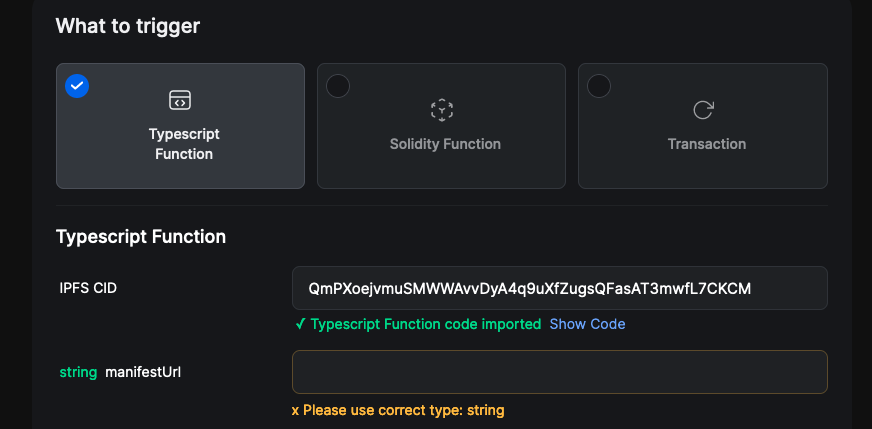
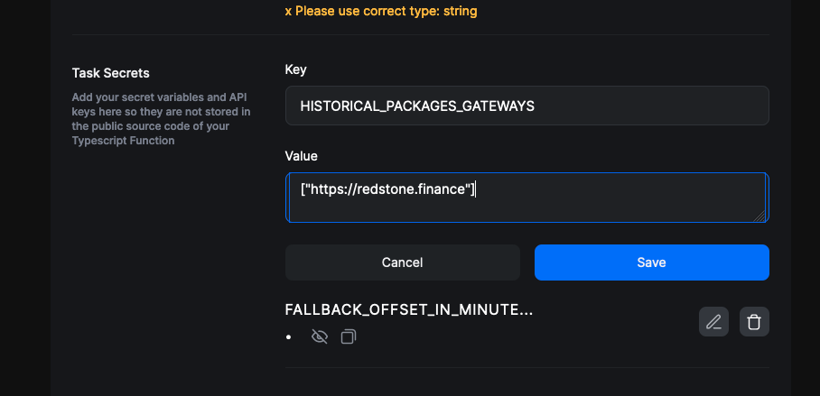

# RedStone Web3 Functions

Web3 Functions are decentralized cloud functions that work similarly to AWS Lambda or Google Cloud, just for web3. They
enable developers to execute on-chain transactions based on arbitrary off-chain data (APIs / subgraphs, etc) &
computation. These functions are written in Typescript, stored on IPFS and run by Gelato.
`w3f` class is injected into the hardhat runtime environment.

You can find the official Web3 Functions
documentation [here](https://docs.gelato.network/developer-services/web3-functions).

### Table of contents

<!-- TOC -->

 -[The `redstone` function](#the-redstone-function)
- [Calling the function](#calling-the-function)
  - [The configuration: use User arguments](#the-configuration-use-user-arguments)
  - [The fallback mode: Use user secrets](#the-fallback-mode-use-user-secrets)
  - [Use the deployed Web3Function on Gelato](#use-the-deployed-web3function-on-gelato)
  - [Deploying an updated Web3Function on IPFS](#deploying-an-updated-web3function-on-ipfs)

<!-- TOC -->

## The `redstone` function

The function is an interface written for the [@redstone-finance/on-chain-relayer](../on-chain-relayer/) package.
The documentation of the RedStone Classic model with relayer can be
found [here](https://docs.redstone.finance/docs/smart-contract-devs/get-started/redstone-classic).

### Calling the function

Use the predefined

```bash
yarn w3f-run
```

Under the hood, it runs the following command:

```bash
npx hardhat w3f-run redstone
```

* Options:
  * `--logs` Show internal Web3 Function logs
  * `--debug` Show Runtime debug messages
  * `--network [NETWORK]` Set the default runtime network & provider.

Example:

```bash
npx hardhat w3f-run redstone --logs
```

### The configuration: use User arguments

Put the `manifestUrls` of your configuration in the [userArgs.json](./web3-functions/redstone/userArgs.json) file.
Make sure the corresponding network is listed in the `hardhat.config.ts` file under `w3f.networks` configuration property.
In the Gelato environment, put the value into a proper field in the create-task form.



That's it about running the function in a regular (non-fallback) mode.

### The fallback mode: Use user secrets

Input your secrets in the `.env` file in the same directory as your web3 function (i.e. `web3-functions/redstone/.env) to run the function in the fallback mode.
To run the function in a non-fallback mode, the user secrets are not needed.

Input your PRIVATE_KEY and ALCHEMY_ID in the top-level `.env` file

```bash
# when >0, runs the trigger functions depending on the manifest in the fallback mode
FALLBACK_OFFSET_IN_MINUTES=2

# put here a json-decodable array of strings;
# **DO NOT*** use the escaping slashes
HISTORICAL_PACKAGES_GATEWAYS=["https://redstone.finance/..."]

SKIP_TX_SENDING_IF_OFFSET_MINUTES_DID_NOT_PASS=true
```



The function fails when any deviation trigger is defined in the manifest, the fallback mode is on,
but the `HISTORICAL_PACKAGES_GATEWAYS` is not properly defined (it must be a non-empty, JSON-decodable array of strings).

### Use the deployed Web3Function on Gelato

To create a task on Gelato, visit https://beta.app.gelato.network/new-task

The latest released CID is written to the [web3-function_redstone.deployed](web3-function_redstone.deployed) file.
We recommend running the function each minute if no other requirement is needed.

### Deploying an updated Web3Function on IPFS

Use the predefined:

```bash
yarn w3f-deploy
```

or

```bash
npx hardhat w3f-deploy redstone
```

command to deploy your web3 function.

The deployer will output your Web3Function IPFS CID, which you can use to create your task on Gelato:

```text
 ✓ Web3Function deployed to ipfs.
 ✓ CID: QmPXoejvmuSMWWAvvDyA4q9uXfZugsQFasAT3mwfL7CKCM

To create a task on Gelato, visit:
> https://beta.app.gelato.network/new-task?cid=QmPXoejvmuSMWWAvvDyA4q9uXfZugsQFasAT3mwfL7CKCM
```
