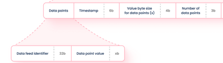
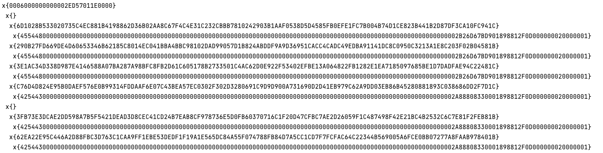

# RedStone Oracles integration with TON

## 💡 How RedStone oracles work with TON

RedStone oracles use an alternative design of providing oracle data to smart contracts. Instead of constantly persisting
data on the contract's storage (by data providers), the information is brought on-chain only when needed (by end users).
Until that moment data remains in the decentralised cache layer, which is powered by RedStone light cache gateways and
streamr data broadcasting protocol. Data is transferred to the contract by end users, who should attach signed data
packages to their function invocations. The information integrity is verified on-chain through signature checking.

To learn more about RedStone oracles design go to the [RedStone docs](https://docs.redstone.finance/docs/introduction)

## 📄 Smart Contracts

### price_manager.fc vel Prices

- Sample oracle contract that consumes RedStone oracles data [price_manager.fc](price_manager.fc) written in
  FunC. It requires [TVM Upgrade 2023.07](https://docs.ton.org/learn/tvm-instructions/tvm-upgrade-2023-07).

#### ⨐ initial data

As mentioned above, the data packages transferred to the contract are being verified by signature checking.
To be counted to achieve the ```signer_count_threshold```, the signer signing the passed data
should be one of the ```signers``` passed in the initial data. There is also needed ```signer_count_threshold``` to be
passed.

Due to the architecture of TON contracts, the initial data must convene with the contract's storage structure,
which is constructed as below:

```
  begin_cell()
    .store_uint(signer_count_threshold, 8)  /// number as passed below
    .store_uint(timestamp, TIMESTAMP_BITS)  /// initially 0 representing the epoch 0
    .store_ref(signers)                     /// serialized tuple of values passed below
    .store_ref(values_dict)                 /// initially an empty cell representing the values dict
  .end_cell());
```

[](#pricemanagerfc-vel-prices)

The value of ```signers``` should be passed as a serialized `tuple` of `int`s.\
📚 See https://github.com/ton-core/ton-core/blob/main/src/tuple/tuple.ts

To define the initial (storage) data for the Prices contract, use the predefined
class [PriceManagerInitData.ts](../src/price-manager/PriceManagerInitData.ts).

In the function parameters below, each `feed_id` is a string encoded to `int` which means, that's a value
consisting of hex-values of the particular letters in the string. For example:
`'ETH'` as an `int` is `0x455448` in hex or `4543560` in decimal, as `256*256*ord('E')+256*ord('T')+ord('H')`.
<br />
📟 You can use: `feed_id = hexlify(toUtf8Bytes(feed_string)))` to convert particular values or
the https://cairo-utils-web.vercel.app/ endpoint<br />

The value of ```feed_ids```  should be passed as a serialized `tuple` of `int`s.\
📚 See https://github.com/ton-core/ton-core/blob/main/src/tuple/tuple.ts

The value ```payload``` is packed from an array of bytes representing the serialized RedStone payload.
<br />
📚 See RedStone data-packing: https://docs.redstone.finance/docs/smart-contract-devs/how-it-works
and the [TON RedStone payload packing](#-ton-redstone-payload-packing) section below.

📚 See also the file [constants.fc](redstone/constants.fc), containing all needed `int`-length constants.

#### ⨗ get_prices

```   
(cell)get_prices_v2(cell data_feed_ids, cell payload) method_id;
```

The functions process on-chain the ```payload``` passed as an argument
and returns a `cell` of aggregated values of each feed passed as an identifier inside ```feed_ids```.

Due to HTTP GET method length limitation in TON API v4, the function is written for TON API v2.

That are just a `method_id` functions - they don't modify the contract's storage and don't consume TONs.

#### ⨒ OP_REDSTONE_WRITE_PRICES

Regardless of the on-fly processing, there also exists a method for processing the ```payload``` on-chain, but
saving/writing the aggregated values to the contract's storage.
The values persist in the contract's storage and then can be read by using ```read_prices``` function.
The timestamp of data last saved/written to the contract is able to read by using the ```read_timestamp``` function.

The method must be invoked as a TON internal message. The arguments of the message are:

* an `int` representing RedStone_Write_Prices name hashed by keccak256 as defined
  in [operations.ts](../src/config/operations.ts)
* a `cell`-ref representing the serialized `tuple` of `int`s.\
* a `cell`-ref representing the packed RedStone payload

```
    int op = in_msg_body~load_uint(OP_NUMBER_BITS);

    if (op == OP_REDSTONE_WRITE_PRICES) {
        cell data_feeds_cell = in_msg_body~load_ref();
        cell payload_cell = in_msg_body~load_ref();
        
        // ...
    }
```

That's an internal message - it consumes GAS and modifies the contract's storage, so must be paid by TONs.

📖 See how it works on: https://ton-showroom.redstone.finance/
📖 Internal messages docs: https://docs.ton.org/develop/smart-contracts/guidelines/internal-messages

#### ⨗ read_prices

```
(tuple)read_prices(tuple data_feed_ids) method_id
```

The function reads the values persisting in the contract's storage and returns a tuple corresponding to the
passed ```feed_ids```.
The function doesn't modify the storage and can read only aggregated values of the ```feed_ids``` saved by
using ```write_prices``` function.

That's just a `method_id` function - it doesn't modify the contract's storage and don't consume TONs.

#### ∮ read_timestamp

```
(int)read_timestamp() method_id 
```

Returns the timestamp of data last saved/written to the contract's storage by using `OP_REDSTONE_WRITE_PRICES` message.

That's just a `method_id` function - it doesn't modify the contract's storage and don't consume TONs.

### price_feed.fc

#### ∱ OP_REDSTONE_FETCH_DATA

Regardless of reading the values persisting in the contract's from outside the network,
there is a possibility for fetching the value stored in the contract for a `feed_id` on-chain directly.
There must be invoked an internal message `OP_REDSTONE_FETCH_DATA`. The arguments of the message are:

* an `int` representing RedStone_Fetch_Data name hashed by keccak256 as defined
  in [operations.ts](../src/config/operations.ts)
* an `int` representing the `feed_id` value.

```
    int op = in_msg_body~load_uint(OP_NUMBER_BITS);


    if (op == OP_REDSTONE_FETCH_DATA) {
        int feed_id = in_msg_body~load_uint(DATA_FEED_ID_BITS);
        
        // ...
    }
```

The message sends to the sender a returning message `OP_REDSTONE_DATA_FETCHED` containing the value and the timestamp
of the value has saved. The message can be then fetched in the sender and processed or saved in the sender's storage.

```
    begin_cell()
        .store_uint(value, MAX_VALUE_SIZE_BITS)
        .store_uint(timestamp, TIMESTAMP_BITS)
    .end_cell()
```

That's an internal message - it consumes GAS and modifies the contract's storage, so must be paid by TONs.

📖 Internal messages docs: https://docs.ton.org/develop/smart-contracts/guidelines/internal-messages

#### ∮ get_price_and_timestamp

```
(int, int)get_price_and_timestamp() method_id
```

Returns the value and timestamp of value last saved/written to the contract's storage by
sending `OP_REDSTONE_FETCH_DATA`
message and fetching the returned value of the `OP_REDSTONE_DATA_FETCHED` message.

That's just a `method_id` function - it doesn't modify the contract's storage and don't consume TONs.

## 📖 TON RedStone Payload packing

Due to limitations of the Bag-size in TON (see https://docs.ton.org/develop/data-formats/cell-boc),
the RedStone payload data - represented as a hex string - needed to be passed to a contract in a more complex way.

Having the RedStone payload as defined here https://docs.redstone.finance/img/payload.png,
the data should be passed as a Cell built as follows.

1. The main *payload* cell consists of:
1. the metadata in the **data-level bits** consisting of the parts as on the image:\
   
1. `1 ... 4` **refs** to *data-package-container* cells.
1. Each *data-package-container* cell consists of `1 ... 4` *data-package* cells.
1. Each *data-package* cell consists of:
1. the data package's signature in the **data-level bits**:\
   
1. one **ref** to a cell containing the data of the rest of the data package on its **data-level**:\
   

#### Current implementation limitations

* The RedStone payload must be fetched by explicitly defining data feeds,
  which leads to **one data point** belonging to **one data package**.
* The total number of data packages must be in range `1 ... 4 * 4 = 16`
  (for example `4` feeds times `4` unique signers or `3` feeds times `5` unique signers).
* The unsigned metadata size must not be exceeding `127 - (2 + 3 + 9) = 113` bytes.

#### Helper

The ```createPayloadCell``` method in the [create-payload-cell.ts](../src/create-payload-cell.ts) file
checks the limitations and prepares the data to be sent to the contract as described above.

#### Sample serialization

The image below contains data for `2` feeds times `3` unique signers:\


### Sample payload

The sample data passed to the contract deployed for the showroom/sample can be fetched by using:
https://d33trozg86ya9x.cloudfront.net/data-packages/payload?data-packages/payload?unique-signers-count=1&data-service-id=redstone-rapid-demo&data-feeds=ETH,BTC&format=hex
That's an example endpoint for `redstone-rapid-demo` data-service id, also for the sample value of the signer-address
that can be used for the initializer (`0xf786a909D559F5Dee2dc6706d8e5A81728a39aE9`)

📟 You can use: [Makefile](../../protocol/scripts/payload-generator/Makefile) by
invoking ```make DATA_NAME=[name] prepare_data``` or
directly from the [payload-generator](../../protocol/scripts/payload-generator) environment directory where `[name]`
is a string you wish.

📖 See: [README.md](../README.md) to see the environment possibilities and sample scripts invoking the functions.

To have defined your custom data-service id and signers, [contact us](#contact).

## ⚠ Possible transaction failures

* The number of signers recovered from the signatures matched with ```addresses``` passed in the initializer
  must be greater or equal that the ```signer_count_threshold``` in the constructor, for each feed.
    * Otherwise, it panics then with the `300` error, increased by the first index of the passed
      feed which has broken the validation.
* The timestamp of data-packages must be not older than 15 minutes in relation to the ```block_timestamp```.
    * Otherwise, it panics then with the `200` error, increased by the first index of the payload's
      data package which has broken the validation, increased additionally by `50` if the package's timestamp is too
      future.
* The internal messages consume gas and must be paid by TONs. The data are available on the contract
  just after the transaction successes.
* The other error codes are defined here: [constants.fc](redstone/constants.fc)

## 🙋‍Contact

Please feel free to contact us on [Discord](https://redstone.finance/discord) or send email to core@redstone.finance
