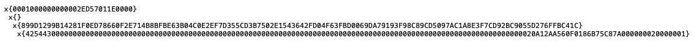
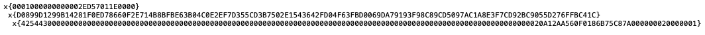
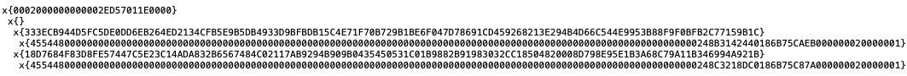
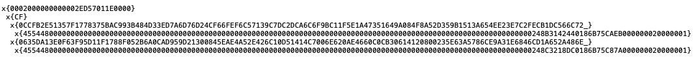
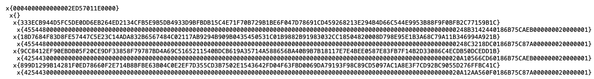
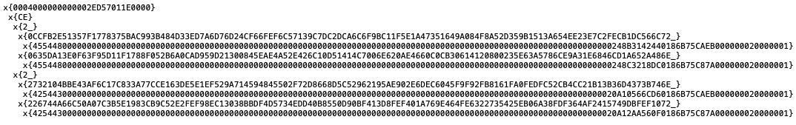

# Review comments 2023-10-16

At the beginning - we're appreciating the work done to describe us all the tips. We'd like to mention that
we're aware of the dictionaries existing in the ToN world, but also of the general advices about
their operation costs as described [here](https://docs.ton.org/ko/develop/howto/fees-low-level#dictionaries).
Comparing the pros and cons of the picked solutions in a wide aspect of readability, code complication and particular
purpose needs, we've decided to change the implementation in some places of the code, as described below.

## Payload serialization

### Use dictionaries instead of an internal tree

|                        | Old Approach (custom `cell` tree)                           | New Approach (`udict` based)                                                  |
| ---------------------- | ---------------------------------------------------------------- | ---------------------------------------------------------------------------------- |
| structure              | 2-level tree based                                               | Dictionary based                                                                   |
| single feed, 1 signer  |                                       |                                                         |
| single feed, 2 signers |                                       |                                                         |
| 2 feeds, 2 signers     |                                       |                                                         |
| Tree depth             | smaller depth for one data package                               | bigger depth for 3+ data packages                                                  |
|                        | same depth for 2 data packages                                   | same depth for 2 data packages                                                     |
| Size limit             | limited to 16 packages, extendable by adding a new level of tree | unlimited number of data packages                                                  |
| Creating               | easier to understand                                             | `serializeDict` method is needed, hard to build from scratch, from outside the sdk |
| Parsing                | 2 nested loops                                                   | easier to parse: one loop                                                          |

#### Gas usage comparison

| in TONs                                 | Old Approach _(before optimizations)_                                                                                                                             | Old Approach _(after optimizations)_                                                                                                                             | New Approach  _(after optimizations)_                                                                                                                             |
| --------------------------------------- | --------------------------------------------------------------------------------------------------------------------------------------------------------------------- | --------------------------------------------------------------------------------------------------------------------------------------------------------------------- | --------------------------------------------------------------------------------------------------------------------------------------------------------------------- | --- |
| single feed, 1 signer                   | Send: 0.0079 Computation: **0.047** [Transaction](https://testnet.tonviewer.com/transaction/226c75616240e5deae14328018dc06d06d8e6148e6cfca1cff9453b34915f7bc) | Send: 0.0080 Computation: **0.047** [Transaction](https://testnet.tonviewer.com/transaction/7872df93ca57dcfa646bd96e31a7af315286bd1b8b02d24d5f65022b72045718) | Send: 0.0079 Computation: **0.046** [Transaction](https://testnet.tonviewer.com/transaction/dd4b9d3001ce189fcb66fec4c004b15ec9b31f8d3a6781692b54454009959650) |     |
| single feed, 4 signers                  | Send: 0.0133 Computation: **0.118** [Transaction](https://testnet.tonviewer.com/transaction/7202d8ea3246c83c1a582eec0ce526eb0edaf78dfe5758c214e538e7df7aec42) | Send: 0.0104 Computation: **0.105** [Transaction](https://testnet.tonviewer.com/transaction/9fe5d23b6718ff5955f10c47c71dbebf38764cf411af9bf2530a07a84296e27e) | Send: 0.0108 Computation: **0.105** [Transaction](https://testnet.tonviewer.com/transaction/7cb1ed7cab5372f9c277b96747a0af48c06f6936ed8e7b729ce71eff012a138a) |
| 4 feeds, 4 signers                      | Send: 0.0339 Computation: **0.428** [Transaction](https://testnet.tonviewer.com/transaction/d4c81ba8ccaded178edd2baf66761545061e39ad6697af285f6689864be97106) | Send: 0.0300 Computation: **0.370** [Transaction](https://testnet.tonviewer.com/transaction/4d8d857bd5b2567349b2885c536477da1c50bc2b4b1f1c6fea3f91a3f9b2491a) | Send: 0.0336 Computation: **0.372** [Transaction](https://testnet.tonviewer.com/transaction/928c69b3c45ca0e1a1fa9c7cad8673fd58997ba0fb8f9da8c9b224d1b323b570) |
| Computation cost: **decreased by ~15%** | Computation: 0.0216 + **0.0254** \* _number_of_packages_                                                                                                              | Computation: 0.0255 + **0.0215** \* _number_of_packages_                                                                                                              | Computation: 0.0243 + **0.0217** \* _number_of_packages_                                                                                                              |

There also was considered an approach with `tuple`-based data-package list,
but the costs are similar to the `udict` based approach.

#### Summary

The New Approach (`udict` based) has been implemented as having no package-number limits.

### Use [general data serialization](https://github.com/ton-blockchain/TEPs/blob/master/text/0064-token-data-standard.md#data-serialization) to avoid the limitation of `cell` size

For now there is not needed to have passed longer (multi-feed) data packages.
We leave the advice as a subject to a further optimization.

## FunC usage

### Use the negation operator `~` instead of `!= true` comparisons

The code has been updated to avoid of using these comparisons.

### Be careful with `tuple`s (they've got limit of 256)

We are aware of the limitation. For our purposes it's not needed to use longer `tuple`s.
The limit is controlled by
the [`tuple_deserialize_integers`](https://github.com/redstone-finance/redstone-oracles-monorepo/blob/main/packages/ton-connector/contracts/redstone/tuple.fc#L109)
function.

### There is an indexing operation instead of using `pop` until we find an item

The code has been updated to avoid of using unnecessary `pop` operations.

### Dictionary will give us free sorting

Regarding the [`tuple` limitations](#be-careful-with-tuples-theyve-got-limit-of-256)
the number of signers as well as the number of feeds passed is limited by 255.
That implies the limitation of the `tuple`'s length to be sorted.
On the other hand, the method is used only for counting the median value.
In most real cases the `tuple`'s length is very small (&leq; 5) and it's not needed to have the operation be using
dictionaries to sort the `tuple`. Also, for cases of 1-2 signers the array won't be sorted as the median value is
determined in place.

We leave the advice as a subject to a further optimization.

## Contracts architecture

### Prefer isolated, independent contracts

The [`price_manager`](https://github.com/redstone-finance/redstone-oracles-monorepo/blob/main/packages/ton-connector/contracts/price_manager.fc)
contracts are prepared for both RedStone modes: the core and classic ones. Having the classic model, the contract
also supports reading the saved (snapshot) data feeds. Still, the contract supports reading the values by another
(for
example [`price_feed`](https://github.com/redstone-finance/redstone-oracles-monorepo/blob/main/packages/ton-connector/contracts/price_feed.fc))
contracts.

The mode as well as supported data feeds, allowed signer list and others will be defined, configured and optimised for
particular purposes and also there won't be a common contract created for different purposes.

Additionally, there is being created a `single_feed_man` contract, as a contract like `price_manager`, but supporting
the single feed only, to omit the communication needs between feed and manager contracts.

### Use datastructures (dictionaries) instead of cell creation

The `price_feed` contract's storage data is located in one `cell`, similar as
for [nft contracts](https://github.com/ton-blockchain/token-contract/blob/main/nft/nft-item.fc)
and there is not needed to build a dictionary.

The `price_manager` contract's storage data structure has **NOT** been changed to an `udict`.
The contract's initial data construction was more complicated and needed to use sdk's `serializeDict` function.
Also, the folllowing [Gas usage comparison](#gas-usage-comparison-1) doesn't have a good effect.

#### Gas usage comparison

| in TONs                                      | New Approach with `cell` storage                                                                                                                                      | New Approach with `udict` storage                                                                                                                                      |
| -------------------------------------------- | --------------------------------------------------------------------------------------------------------------------------------------------------------------------- | ---------------------------------------------------------------------------------------------------------------------------------------------------------------------- |
| single feed, 1 signer                        | Send: 0.0079 Computation: **0.046** [Transaction](https://testnet.tonviewer.com/transaction/dd4b9d3001ce189fcb66fec4c004b15ec9b31f8d3a6781692b54454009959650) | Send: 0.0080 Computation: **0.056**  [Transaction](https://testnet.tonviewer.com/transaction/d1de91fe9c46dc090b16e25b8bbf84b88918800414513a9e7ff1df6f7f7f7271) |
| single feed, 4 signers                       | Send: 0.0108 Computation: **0.105** [Transaction](https://testnet.tonviewer.com/transaction/7cb1ed7cab5372f9c277b96747a0af48c06f6936ed8e7b729ce71eff012a138a) | Send: 0.0136 Computation: **0.116** [Transaction](https://testnet.tonviewer.com/transaction/596ac33d361d5a6cf4cb48d3f57e6899c75e258f64d90605402689828ba9c2a4)  |
| 4 feeds, 4 signers                           | Send: 0.0336 Computation: **0.372** [Transaction](https://testnet.tonviewer.com/transaction/928c69b3c45ca0e1a1fa9c7cad8673fd58997ba0fb8f9da8c9b224d1b323b570) | Send: 0.0326 Computation: **0.391** [Transaction](https://testnet.tonviewer.com/transaction/9b82ddae1f5828cf8dae648faa39943500c663baf806bfc5d68eed7816857762)  |
| Computation cost: **increased by ~0.01 TON** | Computation: **0.0243** + 0.0217 \* _number_of_packages_                                                                                                              | Computation: **0.0336** + 0.0223 \* _number_of_packages_                                                                                                               |

## Review comments 2023-12-18

Some small message-sending and address-comparing tweaks in code were done.

Additionally, there is created a `sample_consumer` contract for consuming the data stored in the `price_feed`
or `single_feed_man` contracts. See [README.md](../contracts/README.md#sample_consumerfc)

## Review comments 2024-01-04

Some message-sending (`forward_payload`-like) tweaks in code were done to allow to carry more complicated initial data.
